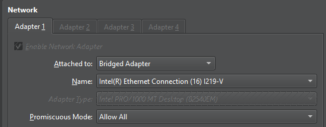
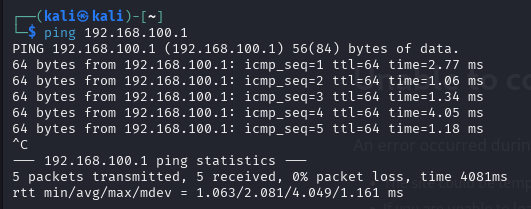
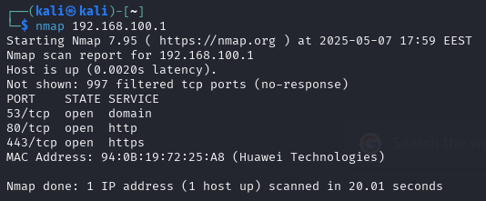

# Documentation for my first attempt at "breaking into" a modem/router

## Premise

I acquired a new router and I took the old one with me to do this exercise.

### Learning objectives

* Kali Linux basics
* Brute force attacks
* Wi-fi security

## Technical specs

| **Software**              | **Version**  |
|---------------------------|--------------|
| VirtualBox                | 7.1.6        |
| Kali Linux                | 1.4.2        |
| bruteforce-salted-openssl |              |
| **Hardware**              | **Firmware** |
| Huawei HG635              |    VER.A & HG635_Elisa7_C262B022     |

## Thought process and order of actions

1. My first idea was to use some sort of network sniffer to get inside the router. After some googling I figured that would not do.
2. I remembered a tool called [Kraken](https://github.com/jasonxtn/Kraken) I used in some TryHackMe exercise I once did and my angle of attack changed to brute forcing the modem. Finger's crossed the default password is still there
3. I installed Kali Linux as a virtual machine as this seems like a fitting place to also start learning using Kali
4. I tried installing Kraken on Kali but ran into some python version error I couldn't be bothered to clear so I searched [the Kali tools page](https://www.kali.org/tools/) and found [bruteforce-salted-openssl](https://www.kali.org/tools/bruteforce-salted-openssl/#bruteforce-salted-openssl-1) which seems fitting for my use case
5. Next step is to install the brute force tool and figure out how to apply it to actually brute force the wifi from the CLI
6. Apparently I'd need a USB wifi adapter with an atheros chip (?) so for now I will try to just break in to the admin page with a wired connection
7. I connected a RJ-45 ethernet cable to the router and my PC, then I set the VirtualBox network setting to bridged adapter, ethernet port, and promiscuous mode to "allow all"  
8. Then I test to ping the modems local IP address and it seems to be working  
9. Looking at the NMAP tells me that domain, HTTP and HTTPS ports are open over TCP which is to be expected 
10. After sleeping on this, I've settled on writing a shell script using xdotool for linux. ChatGPT helped me finalize the script.
11.

## Note

This project is done purely in white hat and learning purposes. The best way to learn defense, is to study offense. My aim for this project is to be able to showcase how easy it is to break into unsecured modems and drive attention to personal cyber security.
